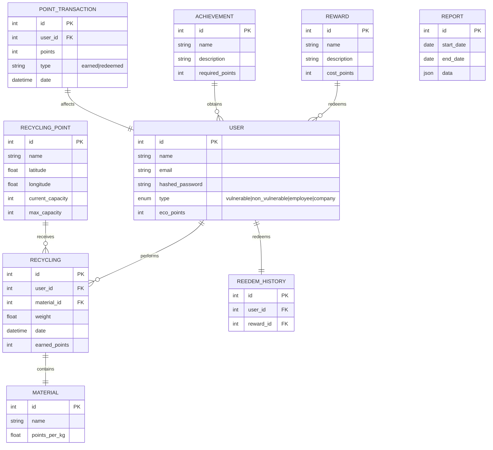

```mermaid
erDiagram
    USER ||--o{ RECYCLING : performs
    USER {
        int id PK
        string name
        string email
        string hashed_password
        enum type "vulnerable|non_vulnerable|employee|company"
        int eco_points
    }
    USER ||--|| REEDEM_HISTORY : redeems
    REEDEM_HISTORY{
        int id PK
        int user_id FK
        int reward_id FK
    }
    RECYCLING ||--|| MATERIAL : contains
    RECYCLING {
        int id PK
        int user_id FK
        int material_id FK
        float weight
        datetime date
        int earned_points
    }
    MATERIAL {
        int id PK
        string name
        float points_per_kg
    }
    RECYCLING_POINT ||--o{ RECYCLING : receives
    RECYCLING_POINT {
        int id PK
        string name
        float latitude
        float longitude
        int current_capacity
        int max_capacity
    }
    REWARD ||--o{ USER : redeems
    REWARD {
        int id PK
        string name
        string description
        int cost_points
    }
    ACHIEVEMENT ||--o{ USER : obtains
    ACHIEVEMENT {
        int id PK
        string name
        string description
        int required_points
    }
    POINT_TRANSACTION ||--|| USER : affects
    POINT_TRANSACTION {
        int id PK
        int user_id FK
        int points
        string type "earned|redeemed"
        datetime date
    }
    REPORT {
        int id PK
        date start_date
        date end_date
        json data
    }
```
